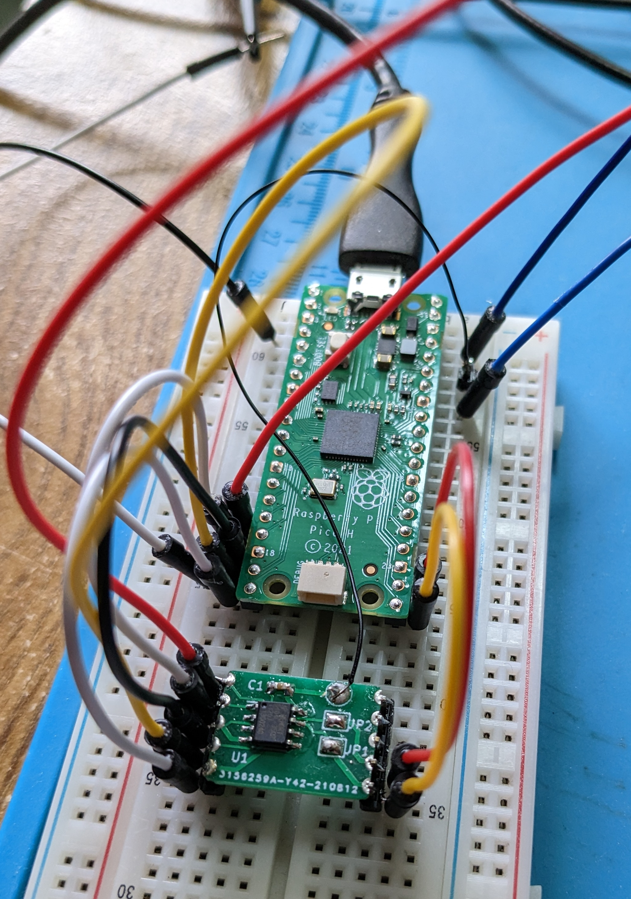
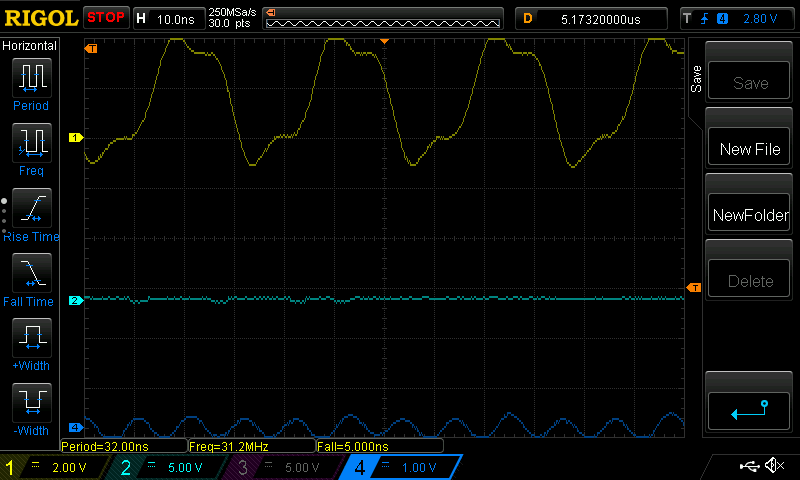
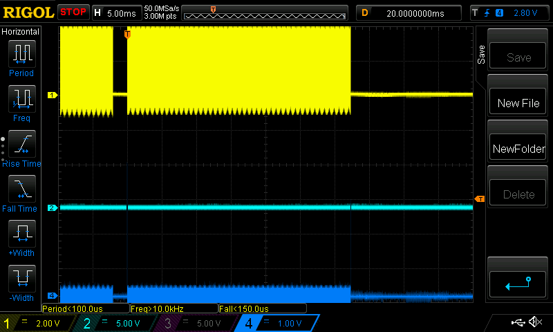
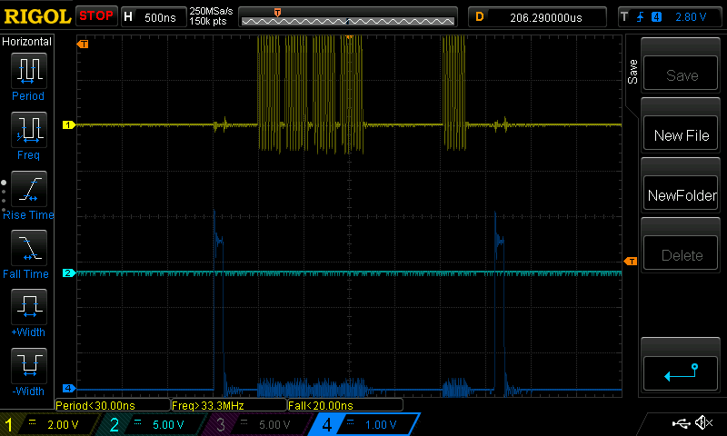

# pico-spi-pseudoram

## Investigation and example of using pseudoram (PSRAM) with a Pico

### Introduction

I needed more RAM on a Raspberry Pi Pico microcontroller, and figured the
best way to get it was to install a pseuodo-SRAM device like
[this one](https://www.mouser.co.uk/ProductDetail/AP-Memory/APS6404L-3SQR-SN?qs=IS%252B4QmGtzzqsn3S5xo%2FEEg%3D%3D),
its datasheet is [here](https://www.mouser.co.uk/datasheet/2/1127/APM_PSRAM_QSPI_APS6404L_3SQR_v2_3_PKG-1954826.pdf).
That particular one is an 64 Mbit device, so 8MB, but there are others in the
range.

The idea is that a standard SRAM chip, fronted by an SPI interface,
 is connected to an SPI connection
in slave mode, with the Pico acting as the SPI master. When the Pico
wants to write to the RAM it creates an SPI write transaction encompassing
the command the pseudo RAM chip understands. That command, plus the
accompanying data, is sent down to the slave which knows how to store
the accompanying data in the RAM at the address given in the command.
For a read, a different command is bundled up and written down to the
device via SPI. This command tells the device which area of memory is
wanted, and the RAM chip prepares it. Then an SPI read is performed
and the RAM device responds with the memory area which was requested.
This is all clearly a lot more fiddly than just using onboard RAM in the
usual way, but depending on what your application is, it might be a
workable technique.

### Connections

In order to use one of these memory chips it needs to be connected
to the Pico's pins. If you're getting a PCB made up then that's easy. If
not, you'll need to solder jumper wires to the legs or something. I used
a little PCB board which is available [here](https://github.com/blackjetrock/picoram).
Its creator has a video [here](https://www.youtube.com/watch?v=YS-xCZsu00U).

When made up it looks like this:

The PSRAM is in the foreground, on its little PCB to which I soldered
headers. It's connected to SPI1 on the Pico. It's a bit unfortunate
that the little board muddles up the connection points which means my
setup isn't easy to copy. But it's only 5 wires so it shouldn't be too
difficult: TX on the Pico goes to Serial-In (SI[0]) on the chip. RX on
the Pico goes to Serial-out (SO[1]) on the chip. The clock (SCK) goes
to clock (SCLK) and whichever GPIO you're using to activate the device
goes to its chip enable (CE) line. SIO[2] and SIO[3] are unused unless
you're planning on using QSPI, which I wasn't (and isn't supported by
the Pico's SPI hardware)

### Software

The software has a couple of tests, switched in via conditional compilation.
Best starting point is the "read ID" test which uses the chip's "ReadID"
command to interogate the chip's ID number. Set the baudrate via the
call to spi_init(). 1,000,000 is a good starting point, everything should
work at that speed even on the dodgiest breadboard setup. It returns the
chip's ID bytes:

    SPI test running...
    Write returned: 0x0004
    Read result is 0x0001, returned: 0x0D
    Read result is 0x0001, returned: 0x5D

0x0D, 0x5D is correct according to the datasheet.

Once you have that working there should be enough in the write and read example code
to get what you want going.

I'm using the fast frequency reads (command 0x0B) in (the default) linear
burst mode which allows reads and writes to work transparently across the
device's 1024 byte boundaries. Fast frequency means the SPI clock can be
boosted up for faster transfers, but at the expense of an extra single
byte read being needed. Lots of small reads will ultimately go slower in
"fast" mode because there's a one byte overhead for each read, but larger
transfers will be quicker. More details [here](https://electronics.stackexchange.com/questions/240500/what-is-the-difference-between-normal-read-and-fast-read-in-the-flash-a25l03). (Note that here appears to be an
error in the datasheet which shows 9 bits of wait-cycles, not 8. Much
confusion, but treating the wait-cycles as a single dummy byte seems to
work.)

My read and write code uses test address 0x000000, which isn't too
informative. In order to specify a different address you need to set up
the command buffer like this:

    uint8_t write_cmd[] = { PRAM_CMD_WRITE,
			    address >> 16, address >> 8, address & 0xFF,
			    0xAA };
    spi_write_blocking(spi1, write_cmd, sizeof(write_cmd));

That writes the value 0xAA into the given 24bit address.

### Clock frequency

The clock frequency is a bit of a bewilderment. The SPI clock can only
run at 50% of the Pico's system clock, so if the system clock is the
default 125MHz the SPI clock can only be set at 62MHz:

    spi_init(spi1, 62 * 1000 * 1000);

If you overclock the Pico you can go higher.

However, that argument to spi_init() is actually a baudrate, not a
frequency. The examples I found on the interwebs confuse the issues
thoroughly. Here's a 'scope shot of the clock when it's been set to
62MHz:

Yellow line is the clock, and its frequency is 31.2MHz. So maybe you
get a baudrate of half the frequency requested? There's a discussion
[here](https://forums.raspberrypi.com/viewtopic.php?t=333214).

That 31.2MHz clock was the best I could get. I wanted the full 84MHz
the chip can do, but I think 31.2MHz is the limit. Also, check your
write/read results as you increase the baudrate because if you set
it too high you get garbage back from the chip. It all seems to work
but actually it doesn't.

### Performance

This is a 100KB block transfer in linear burst, fast read mode:

About 35ms. The write was about the same. For comparison a 100KB
read from the Pico's onboard flash is 9ms, but  doing the flash
erase/write is about 600ms. (I needed better write performance,
which is why I looked into this SPI RAM idea.)

This is a one byte read under the same circumstances:

That's a 4 byte write, which is the (non-fast frequency) read command,
followed by a single byte read. The blue blips are my test pin which
I set to bookend the transaction and trigger the 'scope. So 300ns or so.

## Licence

I released this under the MIT Licence. Credit me if you reproduce it,
but if you just learn from it then no credit is necessary.

Derek Fountain, April 2023